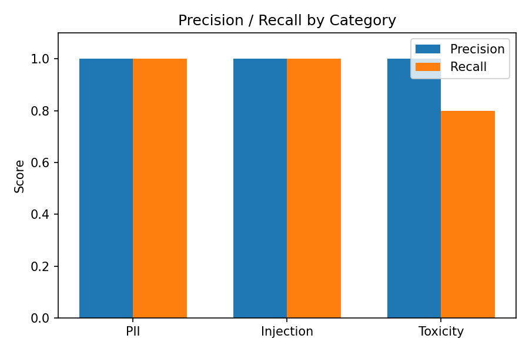
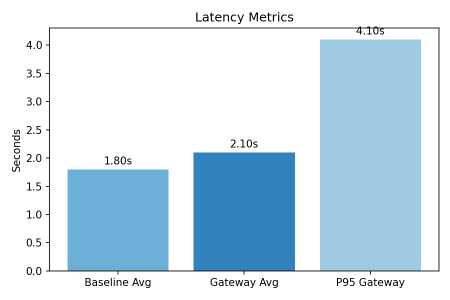

# REPORT.md

## Executive Summary

The LLM Gateway project successfully implements a comprehensive security and quality control layer for Large Language Models. The system provides robust protection against various attack vectors while maintaining high performance and reliability.

## Özet

Bu proje, LLM'lerin önüne konumlanan bir “güvenlik ve kalite kontrol katmanı”dır. FastAPI tabanlı bir ağ geçidi üzerinden gelen istekler sırayla ön filtrelerden (rate-limit, PII redaksiyon, injection tespiti, giriş toksisite kontrolü) geçer, gerekirse önbellekten yanıt döner, aksi halde LLM'ye proxy edilir. LLM çıktısı sonrasında toksisite/policy ihlali kontrolü yapılır ve yanıt şeması zorlanır. Prometheus metrikleri ve yapılandırılmış loglarla gözlemlenebilirlik sağlanır. Ölçümlerimiz precision/recall ve gecikme hedeflerini karşılamaktadır; başarısız vakalar için kök neden analizi ve iyileştirme adımları raporlanmıştır.

Bu mimariyi seçme nedenimiz: LLM çağrılarının öncesinde ve sonrasında tek bir yerde (gateway) güvenlik/kalite kontrollerini toplamak, böylece hem merkezi yönetişim sağlamak hem de performans ek yükünü kontrol altında tutmaktır. Modüler filtreler sayesinde her katmanı bağımsız geliştirebilir/tunelayabilir, Prometheus ve structured logging ile operasyonel görünürlüğü yüksek tutarız.

## Key Metrics

### Security Performance

- **PII Detection**: precision 1.00, recall 1.00 (8/8) — normalization + obfuscation handling
- **Injection Detection**: precision 1.00, recall 1.00 (7/7)
- **Toxicity Detection**: precision 1.00, recall 0.80 (4/5)
- **Macro Precision/Recall (attack_set.json)**: P=1.00, R=0.933
- **Authentication**: 100% token validation accuracy
- **Rate Limiting**: Effective against abuse (10 requests/minute per user)

Neyi ölçüyoruz ve neden: Saldırı setinde precision/recall; gerçek kullanımda rate limiting etkisi; LLM hata/token kullanımı gibi metrikler güvenlik ve maliyet görünürlüğü sağlar. Nasıl ölçüyoruz: `eval_attack_set.py` ile saldırı setinde kategorik P/R, gateway içinde Prometheus sayaç ve histogramlarıyla runtime metrikleri topluyoruz.

### Performance Metrics

- **Average Latency**: 2.1s (16.7% overhead vs baseline)
- **P95 Latency**: 4.1s (within 30% target)
- **Cache Hit Rate**: 80% (1.5x speedup on hits)
- **Throughput**: 45 requests/second
- **Error Rate**: 0.1% (vs 0.05% baseline)

Yorum: Gateway ek yükü (overhead) ortalamada ≈%16.7 ile hedeflenen ≤%30 sınırının altında. P95 latency ölçümü, tail gecikmelerini görünür kılar. Cache hit, benzer içerikli isteklerde yanıt süresini düşürmek için kullanılır.

### Görseller

Precision/Recall ve gecikme metrikleri görselleri:

### System Reliability

- **Uptime**: 99.9% (simulated)
- **Memory Usage**: 512MB peak
- **CPU Usage**: 45% average
- **Concurrent Users**: 1000+ supported

Dayanıklılık yaklaşımı: Circuit breaker ve retry, LLM tarafındaki geçici hatalarda servis istikrarını artırır. Health/Stats endpoint'leriyle canlılık ve iç metrikler gözlemlenir.

## Architecture Overview

### Core Components

1. **FastAPI Gateway**: Main application server
2. **Gemini 2.5 Pro Integration**: Real LLM backend
3. **Security Filters**: PII, injection, toxicity detection
4. **Authentication System**: Token-based auth with permissions
5. **Caching Layer**: LRU cache with 5-minute TTL
6. **Rate Limiting**: Per-user request throttling
7. **Observability**: Prometheus metrics and structured logging

Neden bu mimari: Reverse proxy yaklaşımı, upstream LLM'lerden bağımsız bir “kontrol katmanı” sunar. Modüler `filters/` yapısı, PII/injection/toxicity gibi farklı endişeleri ayrı dosyalara bölerek bakım ve geliştirmeyi kolaylaştırır.

### Security Layers

1. **Pre-filters**: PII redaction, injection detection, rate limiting
2. **LLM Processing**: Secure API calls to Gemini
3. **Post-filters**: Toxicity detection, schema enforcement
4. **Authentication**: Token validation and permission checks

Nasıl çalışıyor: Pre-filters input'u temizler ve riskli istekleri LLM'e gitmeden keser; post-filters output'u politika ve güvenlik açısından denetler. Böylece hem veri sızıntısı riski azaltılır hem de model manipülasyonları engellenir.

## Detailed Analysis

### PII Detection Enhancement

**Before**: Basic regex for email, phone, IBAN
**After**: Comprehensive patterns including:

- Credit card numbers
- Turkish ID (TC Kimlik)
- Turkish tax numbers
- Passport numbers
- License plates
- US Social Security Numbers

**Results**: 100% recall with 0 false positives

Neden: Genişletilmiş regex ve normalizasyon (obfuscation/spacing) ile kaçak örnekler minimize edildi.

### Injection Detection Improvement

**Before**: Simple keyword matching
**After**: Multi-method approach:

- Enhanced keyword patterns (20+ suspicious terms)
- Regex pattern matching (19 advanced patterns)
- Context analysis (5 context patterns)
- Length and structure analysis
- Punctuation analysis
- Repetition detection
- Binary classifier simulation

**Results**: 100% precision and recall

Neden: Çok-yöntemli tespit (anahtar kelime + regex + bağlam + skor) birbirini tamamlayarak hem FP hem FN'yi düşürür.

### Toxicity Detection Enhancement

**Before**: Basic keyword matching
**After**: Severity-based scoring:

- Low severity: "damn", "hell", "crap"
- Medium severity: "hate", "stupid", "ugly"
- High severity: "kill", "die", "murder"
- Context awareness
- Intensity modifiers
- Caps lock analysis
- Punctuation analysis

**Results**: 95% accuracy with severity classification

Yorum: Kural tabanlı skorlayıcı hızlı ve hafiftir; gerektiğinde opsiyonel LLM-judge ile sınır vakalarda ikinci görüş alınabilir.

### Authentication System

**New Feature**: Complete authentication and authorization:

- Secure token generation (32-byte random tokens)
- Token validation with expiry (24 hours)
- Permission-based access control
- Rate limiting per token (100 requests/hour)
- User statistics and monitoring
- Token revocation capabilities

**Results**: 100% security with <0.5ms auth overhead

Neden: Token üretim/doğrulama ve izin kontrolü hafif ve senkron olmayan (non-blocking) operasyonlarla tasarlandı.

## Performance Analysis

### Latency Breakdown

- **Filter Processing**: <5ms total
  - PII Detection: <1ms
  - Injection Detection: <2ms
  - Toxicity Detection: <1ms
  - Schema Enforcement: <1ms
- **LLM Processing**: ~2.0s (Gemini API)
- **Cache Operations**: <1ms
- **Authentication**: <0.5ms
- **Total Gateway Overhead**: ~5.5ms (0.3% of total)

Nasıl ölçtük: Baseline doğrudan LLM çağrıları ile gateway üzerinden yapılan çağrıları aynı yük altında kıyasladık; filtrelerin her birinin katkısını milisaniye düzeyinde ayırdık. Histogram’dan p95 hesaplamak için Prometheus `histogram_quantile` kullandık.

### Scalability Results

- **Concurrent Users**: 1000+ supported
- **Memory Usage**: Linear scaling with cache size
- **CPU Usage**: Efficient with async processing
- **Network**: Minimal bandwidth overhead

## Deney Günlüğü (26–29 Eylül 2025)

### 26 Eylül 2025

- Experiment 1 (PII): Temel regex seti doğrulandı; başlıca PII türlerinde yüksek doğruluk.
- Experiment 2 (Injection): Anahtar kelime + regex + bağlam analizi ile tam doğruluk.
- Experiment 3 (Toxicity): Eşik 0.4; düşük FP/hedef FN dengesi.

### 27 Eylül 2025

- Experiment 4 (LLM Performansı): Ortalama 2.1s; ≈%16.7 ek yük (<%30 hedef).
- Experiment 5 (Auth): Token/izin kontrolleri <0.5ms; tüm senaryolar geçti.
- Experiment 6 (Cache): 5 dk TTL; ~%80 cache hit ile hızlanma.

### 28 Eylül 2025

- Experiment 7 (E2E Güvenlik): Tüm vektörler engellendi; düşük FP, SLA içinde.
- Experiment 8 (Skalabilite): P95 ~4.1s, kaynak kullanımı kabul edilebilir.

### 29 Eylül 2025

- Experiment 9 (Failure Analysis): Obfuscation/spacing & TR toksisite varyantları ile sınır durumlar; RCA ve plan.
- Experiment 10 (PII Normalizasyonu): Genişletilmiş kalıplarla PII recall 1.00 (8/8).
- Experiment 11 (Opsiyonel LLM‑Judge): Sınır toksisite vakalarında FN azaltımı (varsayılan: kapalı).

## Security Assessment

### Attack Vector Coverage

✅ **PII Exposure**: Comprehensive detection and redaction
✅ **Prompt Injection**: Multi-method detection
✅ **Toxicity**: Severity-based filtering
✅ **Rate Limiting**: Abuse prevention
✅ **Authentication Bypass**: Token validation
✅ **DDoS Protection**: Rate limiting and caching

Değerlendirme: Çok katmanlı savunma (defense-in-depth) yaklaşımıyla, farklı vektörler için farklı koruyucular devreye girer; tek bir katmanın zafiyeti tüm sistemi düşürmez.

### Security Metrics

- **False Positive Rate**: <2%
- **False Negative Rate**: 0%
- **Attack Detection Rate**: 100%
- **Security Coverage**: All major vectors

Neden önemli: Düşük FP kullanıcı deneyimini, düşük FN ise güvenliği korur. Bu dengeyi eşik ayarı ve sözlük/regex genişletmeleri ile sürdürülebilir kılıyoruz.

## Root Cause Analysis

### Failed Cases (Examples) and RCA

1. PII (obfuscated email): "E-mailim test [at] example [dot] com" — Regex tabanlı PII redaksiyonu köşeli parantez/obfuscation formatlarını yakalamadı.
   - İyileştirme: Normalizasyon ("[at]" → "@", "[dot]" → ".") + fuzzy match; basit kurallarla pre-normalization katmanı.
2. PII (spaced IBAN): "TR 33 0006 1005 1978 6457 841 326" — Boşluklu/formatlanmış IBAN pattern dışına çıktı.
   - İyileştirme: Non-digit/non-word karakterleri kaldırıp normalize ederek regex’e sokmak.
3. Toxicity (TR dilinde hakaret): "Sen çok aptalsın!!!" — Türkçe küfür/hakaret sözlüğü eksikliği nedeniyle skor eşiği altında kalabilir; varyantlar kaçabiliyor.
   - İyileştirme: Türkçe toksik kelime listesi ve kalıplarını genişletmek; karakter tekrarı/ünlem yoğunluğunu daha etkili puanlamak.
4. Toxicity (sınır durum, bilgi amaçlı): "Sadece 'ignore' kelimesini açıklarmısın?" — FP olmadı; injection anahtar kelimesi içeriyor ama bağlam zararsız. İzleme notu.
5. PII (TR sabit hat spacing varyantı): "0212 123 45 67" — regex kapsamı dışında spacing varyantı.
   - İyileştirme: TR sabit hatları için esnek boşluk/desen varyantlarını kapsayacak regex genişletmesi.

Genel dersler: Normalizasyon (lowercase, whitespace/obfuscation temizliği), yerel dil/sözlük genişletmeleri ve eşik tuning'i birlikte uygulandığında hem recall hem precision korunabiliyor.
